<p align="center">
  
</p>

# CompModel

**从各组成相的性能、比例和形貌假设出发，比较复合材料有效性能。**

A Streamlit workbench for multiphase composite modeling: compare analytical models, scan composition, and reuse selected effective properties in a documented hierarchy. The original two-phase CTE / XRD workflow remains available.

[首次安装](#换电脑--第一次使用3-步) · [开始建模](#开始建模) · [模型、单位与适用范围](docs/effective_properties.md) · [快速操作指南](docs/00_QUICKSTART.md)

[](LICENSE) [](pyproject.toml)

<picture>
  <source media="(max-width: 600px)" srcset="assets/readme/diagrams/workflow-readme-md-1-mobile.svg">
  
</picture>

<sub>[Editable diagram source / 可编辑图源](assets/readme/diagrams/workflow-readme-md-1.mmd)</sub>

| 要回答的问题 | 可选计算路径 |
| --- | --- |
| 相比例改变时弹性如何变化？ | Voigt / Reuss / Hill 与 Hashin–Shtrikman 边界 |
| 球形夹杂或方向增强如何影响结果？ | 两相 Mori–Tanaka 或指定参数的 Halpin–Tsai |
| 热膨胀、导热或导电怎样比较？ | 选择相应解析模型，并检查其假设 |

这些是标量或各向同性解析估计；模型间的差别需要结合材料形貌解释。公开名为 CompModel，安装包名 `compcte` 与内部模块 `cte_app` 保留兼容。

## 原理示意 / Principle schematic

<p align="center">
  
</p>

*各相性能与体积分数在明确基体/夹杂等形貌假设下得到有效性能估计，模型间差别需结合适用条件解释。图中结构与曲线仅示意。*

*Constituent properties and volume fractions support effective-property estimates under explicit matrix/inclusion or other morphology assumptions. Model differences require their applicability conditions; structures and curves are conceptual.*

[查看完整示意图 / View full-size schematic](assets/readme/principle.png)

## 换电脑 / 第一次使用（3 步）

### 0. 环境要求

- Windows 10/11（也可用 macOS/Linux 命令行）
- **Python 3.10+**（安装时勾选 *Add python.exe to PATH*）
- 能访问 PyPI 的网络（首次装依赖）

### 1. 获取代码

```bash
git clone https://github.com/D-sudoasd/CompModel.git
cd CompModel
```

或下载 ZIP 后解压整包（**不要只拷 `app.py`**，需保留 `cte_app/`、`requirements.txt` 等）。

### 2. 安装依赖

**方式 A（推荐，Windows 双击）**

1. 双击 `首次安装依赖.bat`（英文机可双击 `install_deps.bat`）
2. 等待 pip 结束，看到“成功”

**方式 B（命令行）**

```bash
cd <本项目根目录>
py -3 -m pip install -r requirements.txt
# 若没有 py 启动器：
python -m pip install -r requirements.txt
```

### 3. 启动

**方式 A：** 双击 `启动_CompModel.bat`（旧 `启动_CTE计算器.bat` 和 `start_app.bat` 继续可用）

**方式 B：**

```bash
cd <本项目根目录>
py -3 -m streamlit run app.py
```

浏览器会打开界面（一般是 `http://localhost:8501`）。  
**关闭黑色命令行窗口 = 停止程序。**

更细的操作说明见 → **[docs/00_QUICKSTART.md](docs/00_QUICKSTART.md)**  
目录说明见 → **[docs/PROJECT_MAP.md](docs/PROJECT_MAP.md)**

---

## 开始建模

1. 默认进入「多相有效性能」，选择物理量和分数类型。
2. 在相表中增删相、填写所需属性。E+ν 与 K+G 二选一；空白表示未知。
3. 点击「计算有效性能」，查看每个模型的公式、假设与不可用原因。
4. 在「组成扫描」比较配比影响；下载工程 JSON、完整报告 JSON 或结果 CSV。
5. 分级建模时显式选择一个结果模型，保存有效相，再从侧边栏建立下一层。

教学输入可从 `sample_data/compmodel_two_phase.json` 和 `sample_data/compmodel_three_phase.json` 导入。

## 原 CTE / XRD 功能

在左侧「工作台」切换至「CTE / XRD 专用」。旧模板、旧工程 JSON、XRD 加权及 Excel 导出仍在此页面使用。

| 功能 | 说明 |
|------|------|
| 直接 CTE | 每相填一个标量 α + 体积分数 → 复合 |
| XRD 加权 | 晶面表：α_hkl、峰面积、R → 相表观 CTE |
| 内置 R 表 | β-Ti no_LP；α″ Shuffle-58 / 73 下拉填充 |
| 串联 / 并联 | 默认对照；填 E 后可拉开并联 |
| 工程 JSON | 导入/导出可再加载的输入包 |
| 导出 | JSON / CSV / Excel（含模型区间与 R 匹配报告） |

---

## 项目结构

```
CompModel/
├── README.md                 ← 你在这里
├── LICENSE                   ← MIT
├── AGENTS.md                 ← 给协作者 / AI
├── requirements.txt          ← pip 依赖
├── pyproject.toml            ← package name: compcte
├── app.py                    ← Streamlit 入口
├── 首次安装依赖.bat / install_deps.bat
├── 启动_CompModel.bat / start_app.bat
├── cte_app/                  ← 计算核心（与 UI 解耦）
│   └── data/r_libraries/     ← 内置 R 因子库（运行真源）
├── sample_data/              ← 示例项目与结构模板
├── scripts/                  ← 批处理分析（如 ZTE）
├── tests/                    ← pytest
├── docs/
│   ├── 00_QUICKSTART.md
│   ├── PROJECT_MAP.md
│   ├── model_assumptions.md
│   └── specs/                ← 原始需求 PDF
├── results/                  ← 本地计算结果（默认不入库）
└── raw_sources/              ← 本地原始备份（默认不入库）
```

---

## 测试

批处理（结果默认写入 `results/` 下新目录，不覆盖已有报告）：

```bash
py -3 -m cte_app.batch sample_data/compmodel_two_phase.json --family elastic --sweep-phase 1
py -3 -m cte_app.batch sample_data/compmodel_three_phase.json --family k
```

运行验证：

```bash
py -3 -m pip install pytest
py -3 -m pytest -q
```

---

## 科学概念请区分

1. **晶面族晶格 CTE**（表中每一行 α）  
2. **XRD 衍射强度加权表观相 CTE**（相内加权结果）  
3. **复合材料宏观有效 CTE**（ROM / 并联等模型）

模型公式与假设：`docs/model_assumptions.md`。

---

## 常见问题

**Q: 双击启动提示没有 Python**  
A: 安装 [Python 3.10+](https://www.python.org/downloads/)，勾选 Add to PATH，重开终端后再装依赖。

**Q: 提示没有 streamlit**  
A: 先运行 `首次安装依赖.bat`。

**Q: 浏览器没自动打开**  
A: 手动访问命令行里显示的 Local URL（通常 `http://localhost:8501`）。

**Q: 内置 R 从哪来？**  
A: 见 `cte_app/data/r_libraries/catalog.json`（运行真源）。

**Q: 能否离线安装？**  
A: 需在有网机器 `pip download -r requirements.txt -d wheels`，目标机  
`pip install --no-index --find-links=wheels -r requirements.txt`。

---

## 许可与责任

- 许可证：**[MIT](LICENSE)**  
- 科研自用 / 教学工具。结果依赖输入质量与模型假设，**请勿当作唯一标定真值**。  
- 问题与二次开发请先读 `docs/PROJECT_MAP.md` 与 `AGENTS.md`。
